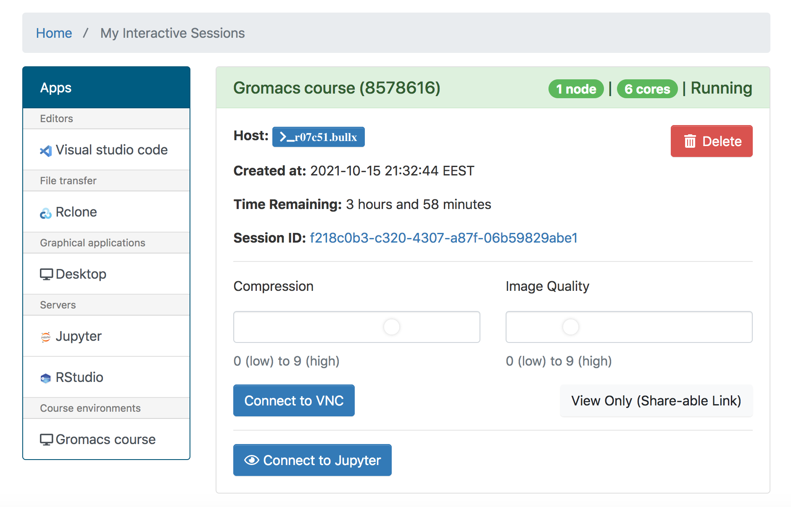
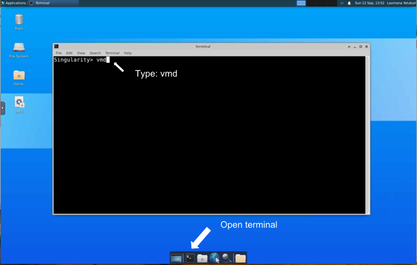

## Provisioning Gromacs-course (FEBS 2021 advanced course) in CSC environment (WIP)

Computational environment  for FEBS course at CSC supercomputer (Puhti) can be accessed using the following two approaches:

- [Method 1: Access VMD and Gromacs Jupyter notebook directly *via* Open OnDemand (OoD) tools](#Access-VMD-and-Gromacs-Jupyter-notebook-via-Open-OnDemand-OoD-tools)
- [Method 2: Access noVNC+VMD and Gromacs Jupyter notebook *via* SSH tunneling](#Access-VMD-and-Gromacs-Jupyter-notebook-via-SSH-tunneling) (A back-up solution to method 1)

### Access VMD and Gromacs Jupyter notebook *via* Open OnDemand (OoD) tools:

1. Access Open OnDemand (OoD) interface on [Puhti login page](https://www.puhti.csc.fi/public/login.html)
2. Login with CSC or course credentials (Users should have accepted Puhti service in [myCSC](https://my.csc.fi/welcome) page under a course ( or own) project before using this service). Login page is as shown below:


3. Once login is successfull, select "Apps" on the top menu bar and then click "Gromacs course". Fill all the necessary information ( e.g., select your CSC project, partition (use "small" when using reservation), computing resources among others) and then click "Launch" 
4. Upon successful launching a job, you can see the following window: 



5. Click on "Connect to VNC" to launch GUI desktop to then VMD (see below picture) 

7. Again on OoD job page, click on "Connect to Jupyter" to launch Gromacs notebook.


### Access VMD and Gromacs Jupyter notebook *via* SSH tunneling:

#### Access VMD via noVNC  and Gromacs notebook as an interactive job

Download singularity image from allas object storage:

```bash

mkdir /scratch/project_xxxx/$USER
cd /scratch/project_xxxx/$USER

# Download singularity image from allas object storage
wget https://a3s.fi/Gromacs_utilities/gromacs-notebook-febs2021.sif

```

Lanuch interactive session as below:

```bash
# start interactive node as below and choose your project name on prompt

sinteractive -c 2 -m 4G -d 250

# Launch VMD and Gromacs notebook by copying the following command and pasting on Puhti terminal:


singularity run -B $HOME -B /run gromacs-notebook-febs2021.sif

```
Just follow the instructions that appear on the terminal when you launch above command.


**Note**: if you don't have SSH-keys in place,  setting-up of SSH port tunneling involves entering some random port number. The SSH command would look like the following:

```bash
ssh  -L NNNN:localhost:NNNN -L MMMM:localhost:MMMM CSCUSERNAME@puhti.csc.fi ssh -L NNNN:localhost:8888 -L MMMM:localhost:38947 CSCUSERNAME@hostname
```
Make sure to use a different portnumber by each user to avoid port collision on login nodes.
 - Jupyter notebook port: set some random number for NNNN,  e.g., NNNN = 8000 + the number in your training account (Final URL for notebook will be in the form:     http://localhost:NNNN/login?next=/notebooks/febs-gromacs-tutorial/md-tutorial/tutorial.ipynb&token=xxxxx ; One can copy exact URL  from the terminal when the container is launched)
 - VNC-VMD port: set some random number for MMMM, e.g., MMMM = 7000 + the number in your training account(Final URL for VNC-VMD will be ine the form:http://localhost:MMMM/vnc.html?password=xxxx; One can copy exact URL  from the terminal when the container is launched)
