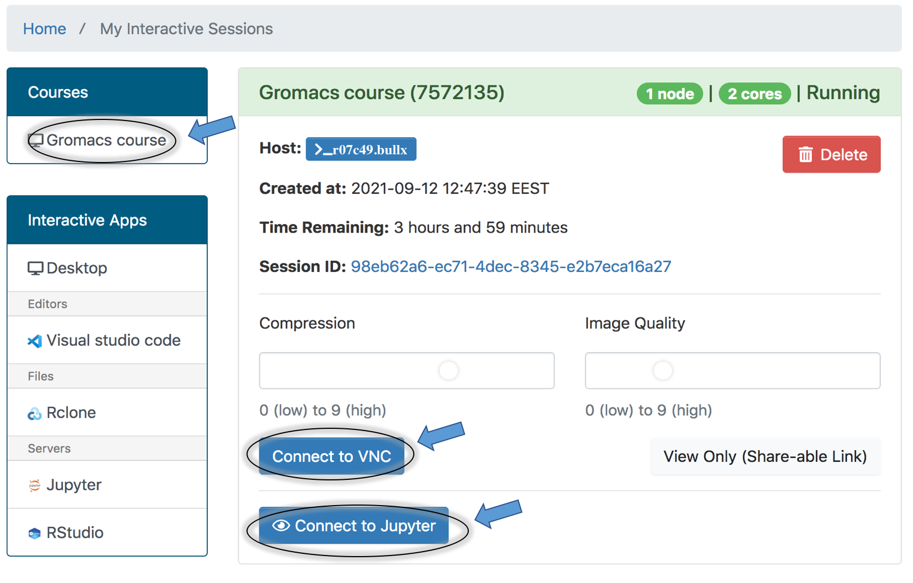
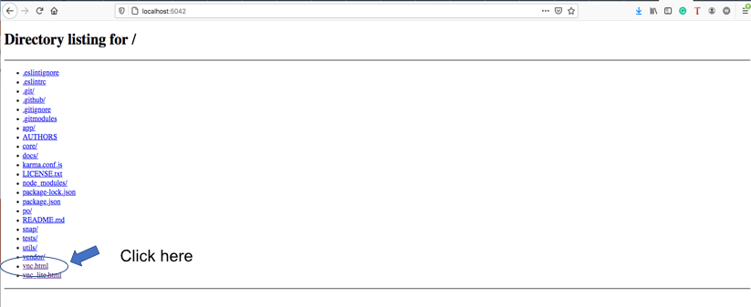
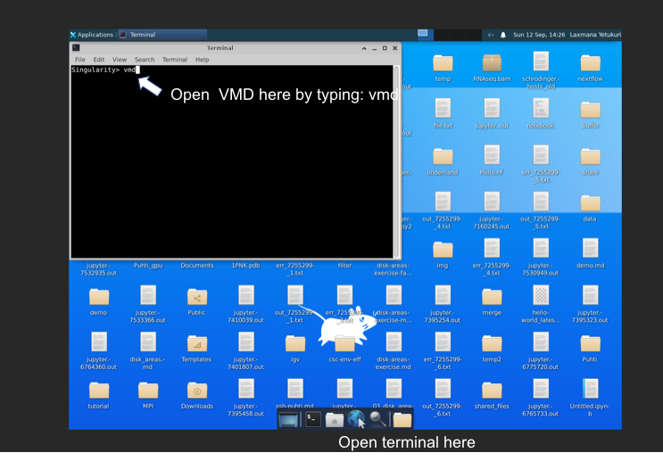

## Provisioning Gromacs-course (FEBS 2021 advanced course) in CSC environment (WIP)

Computational environment  for FEBS course at CSC supercomputer (Puhti) can be accessed using the following two approaches:

- [Method 1: Access VMD and Gromacs Jupyter notebook directly *via* Open OnDemand (OoD) tools](#Access-VMD-and-Gromacs-Jupyter-notebook-via-Open-OnDemand-OoD-tools)
- [Method 2: Access noVNC+VMD and Gromacs Jupyter notebook *via* SSH tunneling](#Access-VMD-and-Gromacs-Jupyter-notebook-via-SSH-tunneling) (A back-up solution to method 1)

### Access VMD and Gromacs Jupyter notebook *via* Open OnDemand (OoD) tools:

1. CSC will provide a URL for accessing course environment via OoD approach
2. Click the URL and login page will open for Puhti authentication (Users should have accepted Puhti service in myCSC page under a course ( or own) project) before using this service. Login page is as shown below:


3. Once login is successfull, select "Courses" on the top menu bar and then click "Gromacs course". Fill all the necessary information ( e.g., select your CSC project, partition (sinteractive or small), computing resources among others) and then click "Launch" 
4. Upon successful launching a job, you can see the following window: 



5. Click on "Connect to VNC" to launch GUI desktop to then VMD (see below picture) 

7. Agian on OoD job page, click on "Connect to Jupyter" to launch Gromacs notebook.


### Access VMD and Gromacs Jupyter notebook *via* SSH tunneling:

#### Access VMD via noVNC as an interactive job

Download singularity image from allas object storage as before

```bash
# Download singularity image from allas object storage
wget https://a3s.fi/Gromacs_utilities/xxxxx.tar.gz
tar -xavf xxx.tar.gz 
cd xxxx
```

1. Lanuch interactive session as below:

```bash
# start interactive node as below and choose your project name on prompt
sinteractive -c 2 -m 4G -d 250

# Launch noVNC+VMD by copying and pasting the following command on Puhti terminal:

singularity exec --env LANG=en_US.UTF-8 --env LC_ALL=en_US.UTF-8 -B /users/$USER -B /run gromacs-notebook-uef.sif /docker_entry_points/vnc 

```

Set-up SSH port tunnels by opening a terminal on your local computer and then copy-pasting the following command:

```bash

ssh  -L NNNN:localhost:NNNN  CSCUSERNAME@puhti.csc.fi ssh -L NNNN:localhost:8888 CSCUSERNAME@hostname
(e.g., with some portnumber=5042, above command: ssh -L 5042:localhost:5042 CSCUSERNAME@puhti.csc.fi ssh -L 5042:localhost:6080 CSCUSERNAME@r07c49) 
                                                                
```
***Note**: Make sure to use a different portnumber by each user to avoid port collision on login nodes.


2. Point your browser to http://localhost:portnumber (e.g., http://localhost:5042) and then click "vnc.html" as shown below:



3. Provide password (Password for vnc is available on the terminal prompt where you have laucnhed the VNC) to access VNC desktop

4. Open linux terminal and then type "vmd" to launch VMD 
 
  

#### Access Gromacs Jupyter notebook as an interactive job

Launch Gromacs Jupyter notebook  by copying and pasting the following command:

```
singularity run --env LANG=en_US.UTF-8 --env LC_ALL=en_US.UTF-8 -B /users/$USER -B /run gromacs-notebook-uef.sif 

```

Above command will start Jupyter server, and then it will print out instructions for a web address and a ssh command. Execute the ssh commands (copy-paste) as instructed to form a tunnel between your machine and the compute node.
